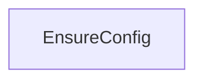
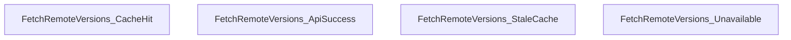
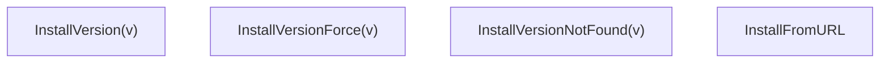
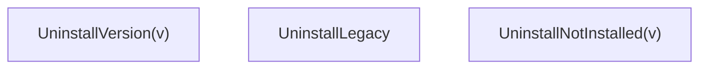
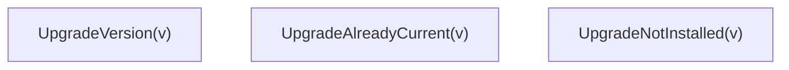
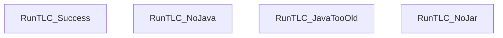
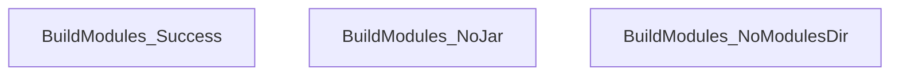
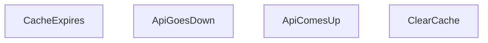

# TLA+ Specification: `tlaplus-cli` Tool Behavior

## Overview

The specification in [cli.tla](file:///home/denis/projects/2026/tlaplus-cli/dev/spec/cli.tla) models the **complete behavioral state space** of the `tlaplus-cli` tool — every command path, error condition, and environmental variation.

## State Variables → Source Mapping

| Variable            | Type                              | Source Module                                                                                                                                   |
| ------------------- | --------------------------------- | ----------------------------------------------------------------------------------------------------------------------------------------------- |
| `configExists`      | BOOLEAN                           | [config.py](file:///home/denis/projects/2026/tlaplus-cli/dev/src/tlaplus_cli/config.py) — `_ensure_config()`                                    |
| `installedVersions` | Set of records                    | [version_manager.py](file:///home/denis/projects/2026/tlaplus-cli/dev/src/tlaplus_cli/version_manager.py) — `list_local_versions()`             |
| `pinnedVersion`     | Record or `"none"`                | [version_manager.py](file:///home/denis/projects/2026/tlaplus-cli/dev/src/tlaplus_cli/version_manager.py) — `get_pinned_version_dir()`          |
| `legacyJarExists`   | BOOLEAN                           | [run_tlc.py](file:///home/denis/projects/2026/tlaplus-cli/dev/src/tlaplus_cli/run_tlc.py) — fallback jar at `cache_dir()/tla2tools.jar`         |
| `cacheState`        | `"empty"` ∣ `"fresh"` ∣ `"stale"` | [version_manager.py](file:///home/denis/projects/2026/tlaplus-cli/dev/src/tlaplus_cli/version_manager.py) — `fetch_remote_versions()` TTL logic |
| `cachedVersions`    | Set of version names              | [version_manager.py](file:///home/denis/projects/2026/tlaplus-cli/dev/src/tlaplus_cli/version_manager.py) — `github_cache.json`                 |
| `apiAvailable`      | BOOLEAN                           | External — GitHub API reachability                                                                                                              |
| `javaInstalled`     | BOOLEAN                           | [check_java.py](file:///home/denis/projects/2026/tlaplus-cli/dev/src/tlaplus_cli/check_java.py) — `get_java_version()`                          |
| `javaMajorVersion`  | Nat                               | [check_java.py](file:///home/denis/projects/2026/tlaplus-cli/dev/src/tlaplus_cli/check_java.py) — `parse_java_version()`                        |
| `hasModulesDir`     | BOOLEAN                           | [build_tlc_module.py](file:///home/denis/projects/2026/tlaplus-cli/dev/src/tlaplus_cli/build_tlc_module.py) — workspace `modules/`              |
| `hasClassesDir`     | BOOLEAN                           | [build_tlc_module.py](file:///home/denis/projects/2026/tlaplus-cli/dev/src/tlaplus_cli/build_tlc_module.py) — workspace `classes/`              |

## Actions → CLI Commands

### Config Initialization



### tla tools list



### tla tools install



### tla tools uninstall



### tla tools upgrade



### tla tools pin


### tla tlc



### tla modules build



### Environment



## Safety Invariants

| Invariant                     | Meaning                                                                                                      |
| ----------------------------- | ------------------------------------------------------------------------------------------------------------ |
| `PinnedIsInstalled`           | The pinned version is always actually installed (or nothing is pinned). Prevents dangling pin references.    |
| `AfterInstallSomethingPinned` | If any version is installed, auto-pinning guarantees at least one is pinned. Users can always run `tla tlc`. |
| `CacheStateValid`             | Cache state is always one of the three valid values.                                                         |

## Liveness Property

| Property               | Meaning                                                                                                                     |
| ---------------------- | --------------------------------------------------------------------------------------------------------------------------- |
| `EventuallyFreshCache` | If the API becomes available, the cache will eventually become fresh. Ensures the system doesn't get stuck with stale data. |

## Key Design Decisions

1. **Cache three-tier fallback**: The spec models the exact `fetch_remote_versions()` logic — try fresh cache → try API → fall back to stale cache → report unavailable.

2. **Auto-pin on first install**: Both `InstallVersion` and `InstallFromURL` auto-pin when `pinnedVersion = "none"`, matching the code in [tools_manager.py:118-120](file:///home/denis/projects/2026/tlaplus-cli/dev/src/tlaplus_cli/tools_manager.py#L117-L121).

3. **Uninstall pin fallback**: When the pinned version is uninstalled, the spec models the fallback to the latest remaining version — matching [tools_manager.py:356-363](file:///home/denis/projects/2026/tlaplus-cli/dev/src/tlaplus_cli/tools_manager.py#L356-L363).

4. **Jar resolution chain**: `RunTLC` and `BuildModules` both model the pinned→legacy fallback chain from [run_tlc.py:61-64](file:///home/denis/projects/2026/tlaplus-cli/dev/src/tlaplus_cli/run_tlc.py#L61-L64).

5. **Environment non-determinism**: `apiAvailable` and `javaInstalled` are initialized non-deterministically and can toggle during execution, modeling real-world conditions.

## Running the Model Checker

```bash
tla tlc cli
```

The [cli.cfg](file:///home/denis/projects/2026/tlaplus-cli/dev/spec/cli.cfg) uses a minimal model (2 versions) to keep the state space tractable while still covering all behavioral paths.
